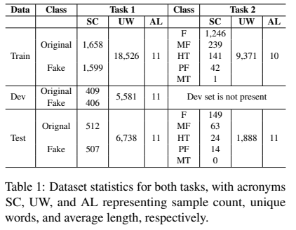
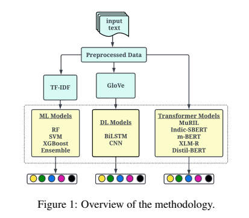
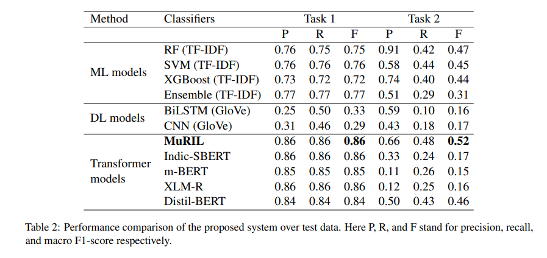
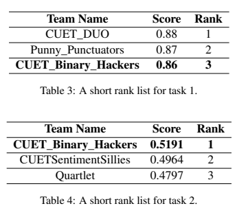
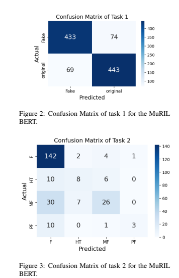

## CUET_Binary_Hackers@DravidianLangTech EACL2024: Fake News Detection in Malayalam Language Leveraging Fine-tuned MuRIL BERT

**Author:** Salman Farsi, Asrarul Hoque Eusha, Ariful Islam, Hasan Mesbaul Ali Taher, Jawad Hossain, Shawly Ahsan, Avishek Das and Mohammed Moshiul Hoque

**Paper:** [Paper in ACL Anthology](https://aclanthology.org/2024.dravidianlangtech-1.29/)

**Venue:** [DravidianLangTech-2024](https://sites.google.com/view/dravidianlangtech-2024/)

## Abstract

Due to technological advancements, various methods have emerged for disseminating news to the masses. The pervasive reach of news, however, has given rise to a significant concern: the proliferation of fake news. In response to this challenge, a shared task in DravidianLangTech EACL2024 was initiated to detect fake news and classify its types in the Malayalam language. The shared task consisted of two sub-tasks. Task 1 focused on a binary classification problem, determining whether a piece of news is fake or not. Whereas task 2 delved into a multi-class classification problem, categorizing news into five distinct levels. Our approach involved the exploration of various machine learning (RF, SVM, XGBoost, Ensemble), deep learning (BiLSTM, CNN), and transformer-based models (MuRIL, Indic-SBERT, m-BERT, XLM-R, Distil-BERT) by emphasizing parameter tuning to enhance overall model performance. As a result, we introduce a fine-tuned MuRIL model that leverages parameter tuning, achieving notable success with an F1-score of 0.86 in task 1 and 0.5191 in task 2. This successful implementation led to our system securing the $3^{rd}$ position in task 1 and the $1^{st}$ position in task 2.


## Contribution

- We conducted a comprehensive comparative analysis of machine learning, deep learning, and transformer-based models through parameter tuning. 
- We propose a fine-tuned MuRIL model that efficiently detects fake news, addresses class imbalance and performs news classification.

## Dataset Analysis

The task involved classifying fake news in Dravidian languages with two sub-tasks: binary classification (original vs. fake) and multi-label classification with five categories. Task 1 had balanced datasets, while Task 2 faced severe class imbalance, especially with the 'FALSE' class dominating.



## Methodology

We explored various machine learning (ML), deep learning (DL), and transformer-based models, including:

- **ML Models**: Random Forest (RF), Support Vector Machine (SVM), XGBoost and Ensemble techniques.
- **DL Models**: Convolutional Neural Network (CNN), Bidirectional Long Short Term Memory (BiLSTM).
- **Transformer-based Models**: Indic-SBERT, m-BERT, MuRIL, Distil-BERT, and XLM-R.

Figure 1 shows a schematic diagram of the methodology.




## Result and Analysis

Five transformer models were tested, with MuRIL performing the best by addressing class imbalance effectively. Other models faced challenges related to dataset nuances and imbalances. Machine learning models showed strong results in Task 1, while transformer models struggled in Task 2 due to class imbalance. Deep learning models underperformed due to language complexity.



A brief ranking of participating teams is shown in Table 5.




## Error Analysis

Error analysis showed that while the model excelled in predicting 'fake' news in Task 1, it struggled with classifying less frequent categories in Task 2, largely due to class imbalance.



## Cite this work
If you find this repository helpful in your work please cite the following
```
@inproceedings{farsi-etal-2024-cuet-binary,
    title = "{CUET}{\_}{B}inary{\_}{H}ackers@{D}ravidian{L}ang{T}ech {EACL}2024: Fake News Detection in {M}alayalam Language Leveraging Fine-tuned {M}u{RIL} {BERT}",
    author = "Farsi, Salman  and
      Eusha, Asrarul  and
      Islam, Ariful  and
      Ali Taher, Hasan Mesbaul  and
      Hossain, Jawad  and
      Ahsan, Shawly  and
      Das, Avishek  and
      Hoque, Mohammed Moshiul",
    editor = "Chakravarthi, Bharathi Raja  and
      Priyadharshini, Ruba  and
      Madasamy, Anand Kumar  and
      Thavareesan, Sajeetha  and
      Sherly, Elizabeth  and
      Nadarajan, Rajeswari  and
      Ravikiran, Manikandan",
    booktitle = "Proceedings of the Fourth Workshop on Speech, Vision, and Language Technologies for Dravidian Languages",
    month = mar,
    year = "2024",
    address = "St. Julian's, Malta",
    publisher = "Association for Computational Linguistics",
    url = "https://aclanthology.org/2024.dravidianlangtech-1.29",
    pages = "173--179",
    abstract = "Due to technological advancements, various methods have emerged for disseminating news to the masses. The pervasive reach of news, however, has given rise to a significant concern: the proliferation of fake news. In response to this challenge, a shared task in Dravidian- LangTech EACL2024 was initiated to detect fake news and classify its types in the Malayalam language. The shared task consisted of two sub-tasks. Task 1 focused on a binary classification problem, determining whether a piece of news is fake or not. Whereas task 2 delved into a multi-class classification problem, categorizing news into five distinct levels. Our approach involved the exploration of various machine learning (RF, SVM, XGBoost, Ensemble), deep learning (BiLSTM, CNN), and transformer-based models (MuRIL, Indic- SBERT, m-BERT, XLM-R, Distil-BERT) by emphasizing parameter tuning to enhance overall model performance. As a result, we introduce a fine-tuned MuRIL model that leverages parameter tuning, achieving notable success with an F1-score of 0.86 in task 1 and 0.5191 in task 2. This successful implementation led to our system securing the 3rd position in task 1 and the 1st position in task 2. The source code will be found in the GitHub repository at this link: https://github.com/Salman1804102/ DravidianLangTech-EACL-2024-FakeNews.",
}

```
## Note
`If you find any anomaly or have any query/suggestion feel free to ping.`
